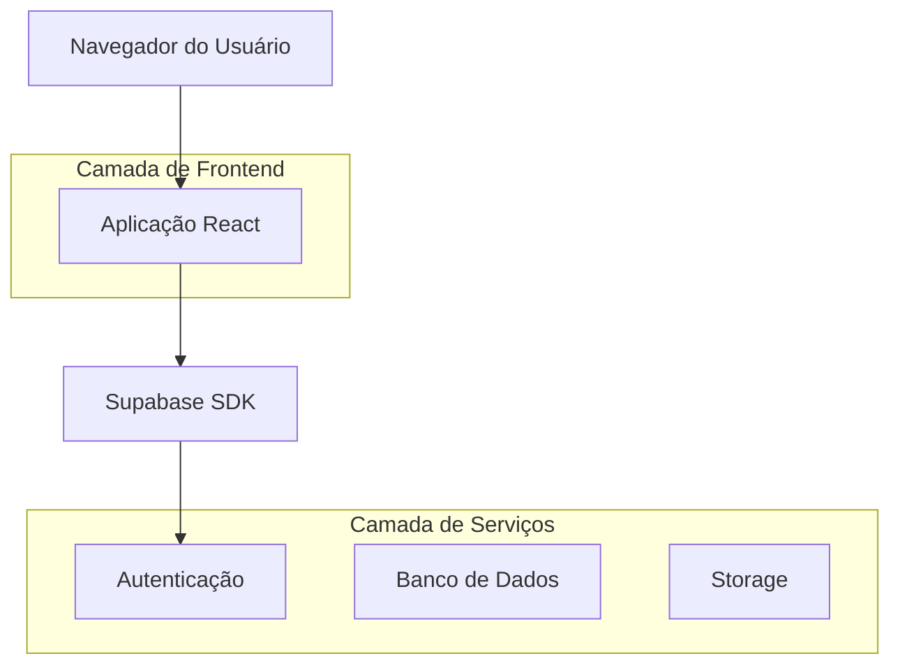
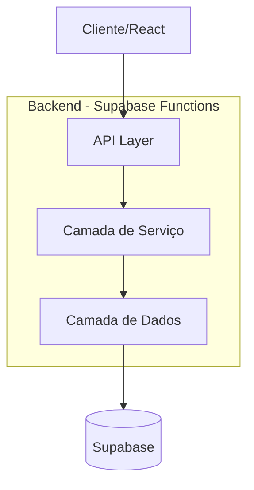
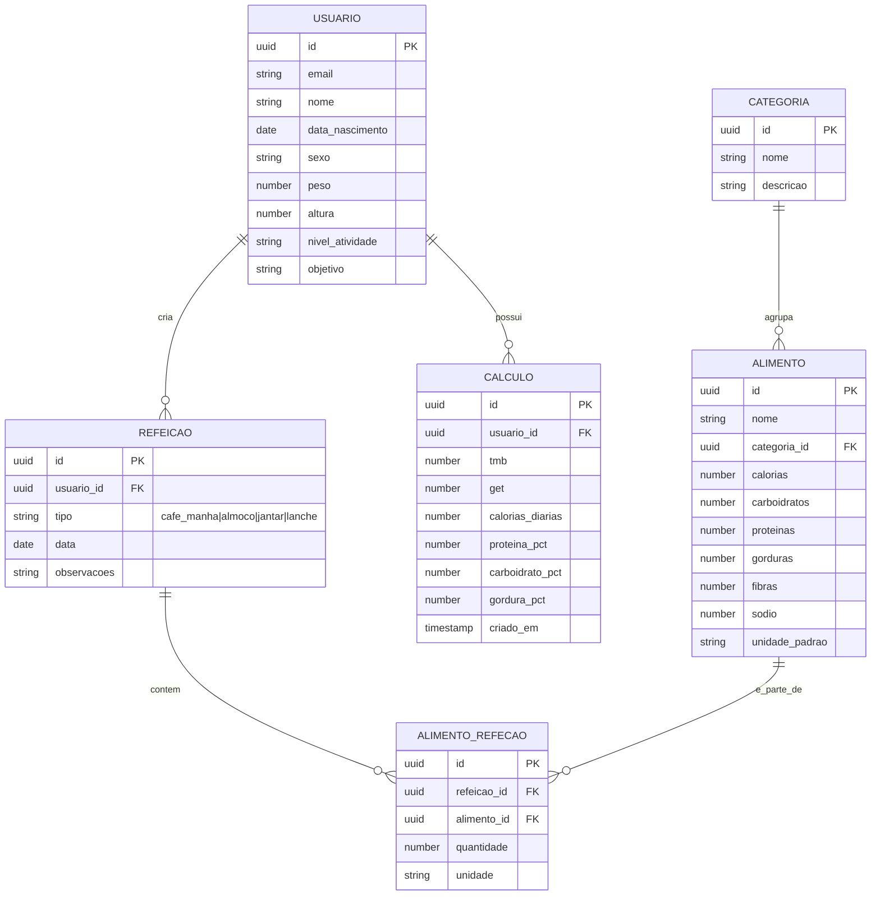

## 1. Arquitetura do Sistema



## 2. Descrição das Tecnologias

- **Frontend**: React@18 + TypeScript + Vite
- **Estilização**: TailwindCSS@3 + HeadlessUI
- **Gerenciamento de Estado**: React Context API + useReducer
- **Biblioteca de Gráficos**: Recharts
- **Biblioteca de Ícones**: Lucide React
- **Validação de Formulários**: React Hook Form + Zod
- **Ferramenta de Inicialização**: vite-init

## 3. Definições de Rotas

| Rota | Descrição |
|------|-----------|
| / | Página inicial com hero section e busca rápida |
| /alimentos | Lista de alimentos com filtros e busca |
| /alimentos/:id | Detalhes nutricionais do alimento |
| /calculadora | Calculadora de necessidades nutricionais |
| /refeicoes | Planejador de refeições |
| /dashboard | Dashboard de acompanhamento nutricional |
| /perfil | Perfil do usuário com configurações |
| /login | Página de autenticação |
| /cadastro | Registro de novo usuário |

## 4. Definições de API

### 4.1 API de Alimentos

```
GET /api/alimentos
```

Parâmetros de Requisição:
| Nome | Tipo | Obrigatório | Descrição |
|------|------|-------------|-----------|
| search | string | false | Termo de busca por nome |
| categoria | string | false | Filtrar por categoria |
| limite | number | false | Número de resultados (padrão: 20) |
| pagina | number | false | Página de resultados |

Resposta:
| Nome | Tipo | Descrição |
|------|------|-----------|
| alimentos | Array | Lista de alimentos |
| total | number | Total de alimentos encontrados |
| pagina | number | Página atual |

Exemplo de Resposta:
```json
{
  "alimentos": [
    {
      "id": "uuid-123",
      "nome": "Maçã",
      "categoria": "Frutas",
      "calorias": 52,
      "carboidratos": 14,
      "proteinas": 0.3,
      "gorduras": 0.2,
      "porcao": "100g"
    }
  ],
  "total": 150,
  "pagina": 1
}
```

### 4.2 API de Cálculos Nutricionais

```
POST /api/calcular-necessidades
```

Corpo da Requisição:
| Nome | Tipo | Obrigatório | Descrição |
|------|------|-------------|-----------|
| idade | number | true | Idade em anos |
| sexo | string | true | "M" ou "F" |
| peso | number | true | Peso em kg |
| altura | number | true | Altura em cm |
| atividade | string | true | Nível de atividade física |
| objetivo | string | true | Objetivo (emagrecer/manter/ganhar) |

Exemplo de Requisição:
```json
{
  "idade": 30,
  "sexo": "M",
  "peso": 75,
  "altura": 175,
  "atividade": "moderada",
  "objetivo": "manter"
}
```

## 5. Arquitetura do Servidor



## 6. Modelo de Dados

### 6.1 Definição das Entidades



### 6.2 Definições de Tabela (DDL)

**Tabela de Alimentos (alimentos)**
```sql
CREATE TABLE alimentos (
    id UUID PRIMARY KEY DEFAULT gen_random_uuid(),
    nome VARCHAR(255) NOT NULL,
    categoria_id UUID REFERENCES categorias(id),
    calorias DECIMAL(8,2) NOT NULL,
    carboidratos DECIMAL(8,2) NOT NULL,
    proteinas DECIMAL(8,2) NOT NULL,
    gorduras DECIMAL(8,2) NOT NULL,
    fibras DECIMAL(8,2) DEFAULT 0,
    sodio DECIMAL(8,2) DEFAULT 0,
    unidade_padrao VARCHAR(50) DEFAULT '100g',
    codigo_taco VARCHAR(50) UNIQUE,
    criado_em TIMESTAMP WITH TIME ZONE DEFAULT NOW()
);

-- Índices para performance
CREATE INDEX idx_alimentos_nome ON alimentos(nome);
CREATE INDEX idx_alimentos_categoria ON alimentos(categoria_id);
CREATE INDEX idx_alimentos_calorias ON alimentos(calorias);

-- Permissões Supabase
GRANT SELECT ON alimentos TO anon;
GRANT ALL PRIVILEGES ON alimentos TO authenticated;
```

**Tabela de Usuários (usuarios)**
```sql
CREATE TABLE usuarios (
    id UUID PRIMARY KEY DEFAULT gen_random_uuid(),
    email VARCHAR(255) UNIQUE NOT NULL,
    nome VARCHAR(255) NOT NULL,
    data_nascimento DATE NOT NULL,
    sexo CHAR(1) CHECK (sexo IN ('M', 'F')),
    peso DECIMAL(5,2),
    altura DECIMAL(5,2),
    nivel_atividade VARCHAR(20) CHECK (nivel_atividade IN ('sedentario', 'leve', 'moderado', 'ativo', 'muito_ativo')),
    objetivo VARCHAR(20) CHECK (objetivo IN ('emagrecer', 'manter', 'ganhar')),
    criado_em TIMESTAMP WITH TIME ZONE DEFAULT NOW(),
    atualizado_em TIMESTAMP WITH TIME ZONE DEFAULT NOW()
);

-- Permissões Supabase
GRANT SELECT ON usuarios TO authenticated;
GRANT UPDATE ON usuarios TO authenticated;
```

**Tabela de Refeições (refeicoes)**
```sql
CREATE TABLE refeicoes (
    id UUID PRIMARY KEY DEFAULT gen_random_uuid(),
    usuario_id UUID NOT NULL REFERENCES usuarios(id),
    tipo VARCHAR(20) CHECK (tipo IN ('cafe_manha', 'almoco', 'jantar', 'lanche')),
    data DATE NOT NULL,
    observacoes TEXT,
    criado_em TIMESTAMP WITH TIME ZONE DEFAULT NOW()
);

-- Índices
CREATE INDEX idx_refeicoes_usuario_data ON refeicoes(usuario_id, data);

-- Permissões
GRANT SELECT ON refeicoes TO authenticated;
GRANT INSERT, UPDATE, DELETE ON refeicoes TO authenticated;
```

## 7. Configurações de Segurança e Performance

### Políticas de Segurança (Supabase RLS)

**Política para usuários visualizarem apenas seus próprios dados:**
```sql
-- Usuários podem ver apenas seus próprios dados
CREATE POLICY "Usuários veem próprio perfil" ON usuarios
    FOR SELECT USING (auth.uid() = id);

-- Usuários podem atualizar apenas seu próprio perfil
CREATE POLICY "Usuários atualizam próprio perfil" ON usuarios
    FOR UPDATE USING (auth.uid() = id);

-- Refeições: usuários veem apenas suas próprias refeições
CREATE POLICY "Usuários veem próprias refeições" ON refeicoes
    FOR SELECT USING (auth.uid() = usuario_id);
```

### Otimizações de Performance

- Implementar cache no frontend para alimentos frequentemente acessados
- Usar React Query para gerenciamento de estado de servidor
- Implementar paginação infinita para listas grandes de alimentos
- Lazy loading para imagens de alimentos
- Debounce de 300ms nas buscas por texto