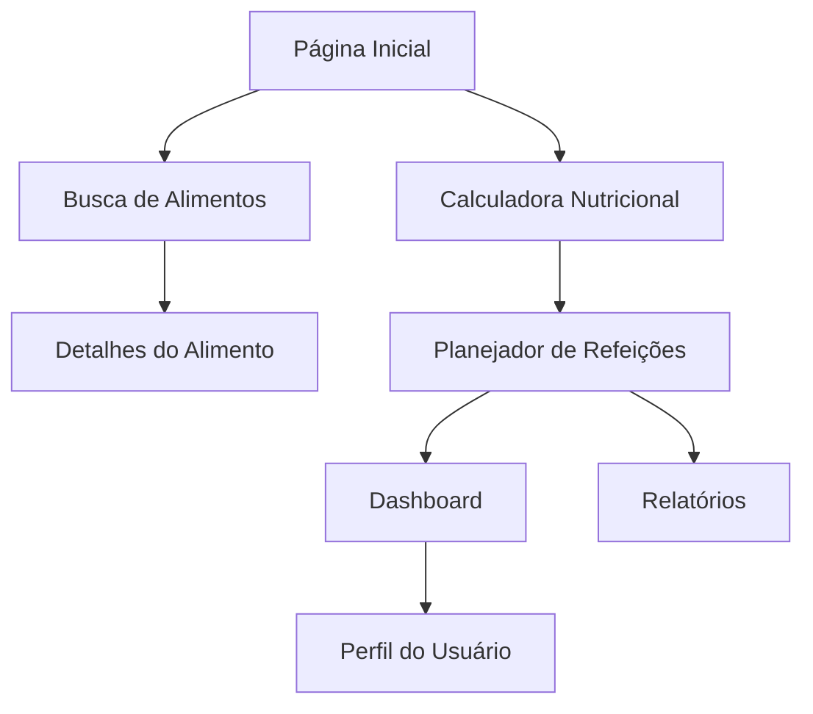

## 1. Visão Geral do Produto

O DietCalc é uma aplicação web para cálculo nutricional e planejamento dietético, utilizando a Tabela TACO como base de dados. A aplicação permite que usuários calculem suas necessidades nutricionais, criem refeições balanceadas e acompanhem seu consumo alimentar de forma intuitiva e precisa.

O produto visa democratizar o acesso à informação nutricional de qualidade, auxiliando profissionais de nutrição e usuários finais no planejamento de dietas personalizadas e no acompanhamento de metas nutricionais.

## 2. Funcionalidades Principais

### 2.1 Papéis de Usuário

| Papel | Método de Registro | Permissões Principais |
|------|---------------------|----------------------|
| Usuário Comum | Cadastro por email | Buscar alimentos, criar refeições, visualizar cálculos nutricionais |
| Nutricionista | Cadastro com verificação de certificado | Todas as funcionalidades do usuário comum + criar dietas para clientes, gerar relatórios |
| Administrador | Convite/criação manual | Gerenciar base de dados TACO, moderar conteúdo, acessar analytics |

### 2.2 Módulos de Funcionalidades

O DietCalc frontend consiste nas seguintes páginas principais:

1. **Página Inicial**: apresentação do produto, busca rápida de alimentos, navegação principal
2. **Busca de Alimentos**: lista de alimentos da TACO, filtros por categoria, busca por nome
3. **Calculadora Nutricional**: cálculo de necessidades calóricas, distribuição de macronutrientes
4. **Planejador de Refeições**: criação e edição de refeições com cálculo nutricional em tempo real
5. **Dashboard**: visualização do consumo diário, progresso em relação às metas, alertas nutricionais
6. **Perfil do Usuário**: configurações pessoais, objetivos, restrições alimentares

### 2.3 Detalhamento das Páginas

| Nome da Página | Módulo | Descrição das Funcionalidades |
|----------------|---------|-------------------------------|
| Página Inicial | Hero Section | Apresentar valor do produto com imagens de alimentos saudáveis e chamada para ação |
| Página Inicial | Busca Rápida | Campo de busca com autocomplete para alimentos populares |
| Página Inicial | Navegação | Menu principal com acesso às funcionalidades principais |
| Busca de Alimentos | Lista de Alimentos | Exibir alimentos em cards com imagem, nome e valores calóricos básicos |
| Busca de Alimentos | Filtros | Filtrar por categoria (frutas, verduras, cereais, etc.) e ordenar por nome/calorias |
| Busca de Alimentos | Busca por Texto | Busca instantânea com highlight dos termos encontrados |
| Calculadora Nutricional | Dados Pessoais | Formulário para idade, sexo, peso, altura, nível de atividade |
| Calculadora Nutricional | Objetivos | Seletor para emagrecimento, manutenção ou ganho de massa |
| Calculadora Nutricional | Resultados | Exibir TMB, GET e distribuição de macronutrientes com gráficos |
| Planejador de Refeições | Criar Refeição | Adicionar alimentos com quantidades e unidades de medida |
| Planejador de Refeições | Cálculo em Tempo Real | Atualizar valores nutricionais totais conforme alimentos são adicionados |
| Planejador de Refeições | Conversão de Unidades | Converter entre gramas, colheres, xícaras automaticamente |
| Dashboard | Resumo Diário | Cards com calorias consumidas vs meta, distribuição de macros |
| Dashboard | Gráficos | Gráficos de barras/pizza mostrando consumo de nutrientes |
| Dashboard | Alertas | Notificações visuais para excessos ou deficiências nutricionais |
| Perfil do Usuário | Informações Pessoais | Editar dados cadastrais e preferências |
| Perfil do Usuário | Restrições | Configurar alergias, restrições alimentares e preferências |
| Perfil do Usuário | Histórico | Visualizar dietas e refeições anteriores |

## 3. Fluxo Principal do Usuário

### Fluxo do Usuário Comum:
1. Usuário acessa a página inicial e realiza busca rápida de um alimento
2. Visualiza detalhes nutricionais do alimento selecionado
3. Acessa a calculadora para determinar suas necessidades calóricas
4. Cria refeições adicionando alimentos com quantidades personalizadas
5. Acompanha seu progresso no dashboard com gráficos e alertas

### Fluxo do Nutricionista:
1. Nutricionista cria perfil completo para seu cliente
2. Calcula necessidades nutricionais baseadas em objetivos específicos
3. Monta dietas completas com múltiplas refeições
4. Gera relatórios detalhados para acompanhamento do cliente

## 4. Design da Interface

### 4.1 Estilo Visual
- **Cores Primárias**: Verde #4CAF50 (saudável), Laranja #FF9800 (energia)
- **Cores Secundárias**: Azul claro #2196F3 (confiança), Cinza #757575 (neutro)
- **Estilo de Botões**: Arredondados com sombra suave, hover com elevação
- **Tipografia**: Fonte sans-serif moderna (Roboto), tamanhos 14px para texto, 18px para títulos
- **Layout**: Baseado em cards com sombras, navegação superior fixa
- **Ícones**: Estilo outline minimalista, preferencialmente usando Material Design Icons

### 4.2 Design das Páginas

| Nome da Página | Módulo | Elementos de UI |
|----------------|---------|-----------------|
| Página Inicial | Hero Section | Imagem de fundo com overlay escuro, texto em branco, botão CTA verde destacado |
| Busca de Alimentos | Lista de Alimentos | Grid responsivo de cards com imagem 4:3, nome em negrito, valores calóricos em destaque |
| Busca de Alimentos | Filtros | Sidebar colapsável com checkboxes para categorias, slider para faixa calórica |
| Calculadora Nutricional | Formulário | Inputs com labels flutuantes, validação em tempo real, botão calcular primário |
| Calculadora Nutricional | Resultados | Cards com valores numéricos grandes, gráfico de pizza para distribuição de macros |
| Planejador de Refeições | Tabela de Alimentos | Tabela com linhas alternadas, colunas de nutrientes coloridas, total fixo no rodapé |
| Dashboard | Cards Métricos | Cards com ícones grandes, números em fonte extra-grande, variações em porcentagem |
| Dashboard | Gráficos | Gráficos interativos com tooltips, animações suaves ao carregar dados |

### 4.3 Responsividade
- **Desktop-first**: Otimizado para telas grandes (1920x1080) com máximo aproveitamento do espaço
- **Mobile-adaptativo**: Layout adapta para tablets (768px) e smartphones (375px)
- **Touch-friendly**: Botões com área de toque mínima de 44x44px, gestos de swipe para navegação
- **Performance**: Lazy loading para imagens, paginação para listas extensas