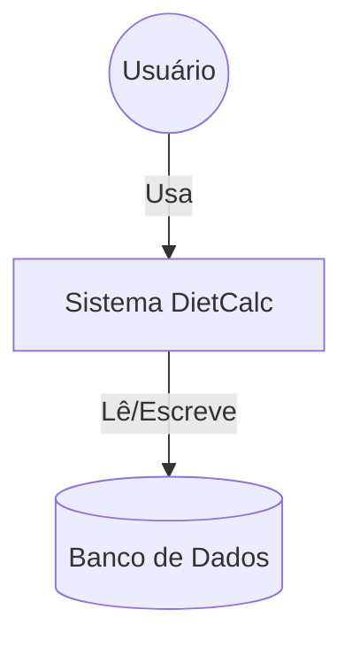

# Arquitetura do Sistema DietCalc

## Diagrama de Contexto

## Backend (FastAPI)
O backend segue uma arquitetura em camadas simples:
- **Routers**: `backend/app/routers/` - Definição dos endpoints HTTP.
- **Services/Controllers**: Lógica de negócio embutida nos routers (para simplicidade do MVP) ou em serviços dedicados.
- **Schemas (Pydantic)**: `backend/app/schemas.py` - Validação e serialização de dados.
- **Models (SQLAlchemy)**: `backend/app/models.py` - Mapeamento Objeto-Relacional (ORM).

### Fluxo de Dados
1. Request chega ao Router.
2. Pydantic valida o payload.
3. SQLAlchemy interage com o Banco (SQLite local ou Postgres remoto).
4. Response é devolvida ao Frontend.

## Frontend (React)
SPA (Single Page Application) construída com Vite.
- **Pages**: Telas principais (`Calculator`, `MealPlanner`, `Dashboard`).
- **Components**: Blocos reutilizáveis (`FoodSelector`, `Charts`).
- **Services**: `api.ts` encapsula chamadas Axios ao backend.

## Persistência
- **Desenvolvimento**: SQLite (`backend/data/dietcalc.db`).
- **Produção**: PostgreSQL (Supabase).
- **Migração**: Scripts em `backend/migrate_to_postgres.py` facilitam a transição.

## Decisões Técnicas
1. **FastAPI**: Escolhido pela performance e documentação automática (Swagger).
2. **TailwindCSS**: Para estilização rápida e responsiva.
3. **Recharts**: Biblioteca leve para gráficos no Dashboard.
4. **Zod**: Validação de formulários no frontend (espelhando validação do backend).
